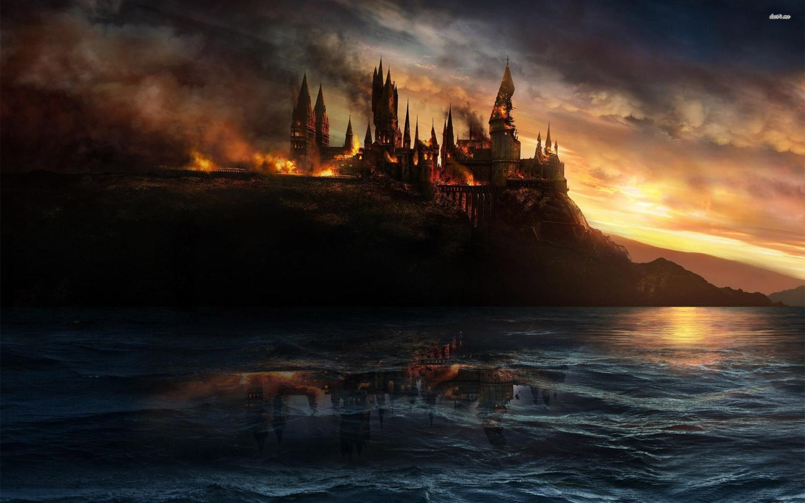
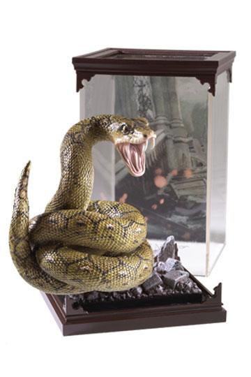

# Seven Horcruxes

## Basic Information

This game features the seven horcruxes from the Harry Potter movie. For every click, the player and the computer draw a pair of horcruxes. When a pair is drawn, player gets a point. When it gets to certain score, they are able to  collect a card from a pool of horcurxes. Whichever player gets to collect all the horcruxes wins the game.

## Tech Stack
    - Javascript
    - HTML
    - CSS

## Images

## Sound

## Unsolved Issues

Resetting the Card Collection
Placement of game rules (flexbox and grid)
Placement of cards drawn
Organize Cards Collected into Player and Computer Sets